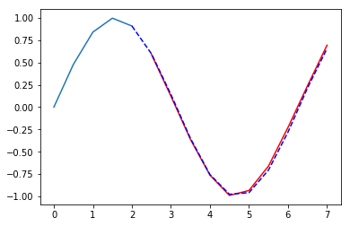
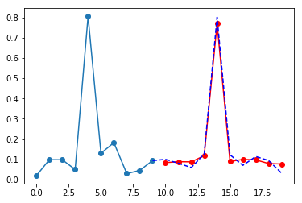
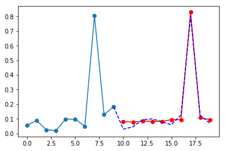

## Sin_wave_pred.ipynb
This is a simple seq2seq case using LSTM. We can understand seq2seq model by this case.
 
red line: pred  
blue line: real  
 
  

## data_preparing.ipynb
CPU data preparing  

## cpu_pred.ipynb
Seq2seq model for cpu busy predicting
 
red line: pred  
blue line: real  
 
  
  

