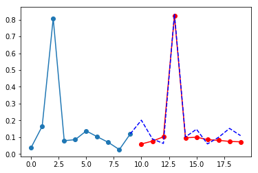

## Sin_wave_pred.ipynb
This is a simple seq2seq case using LSTM. We can understand seq2seq model by this case.

## data_preparing.ipynb
CPU data preparing

## cpu_pred.ipynb
Seq2seq model for cpu busy predicting

