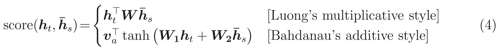

# Chat-Bot

This is a Chinese chat-bot based on seq2seq attention model.

The datasets are from 民視八點檔.

### Requirements

    tensorflow 1.0.1,
    numpy 1.12.1,
    gensim 1.0.1,
    jieba 0.39,
    matplotlib 2.0.0

### <a href="chatbotdemolab301j.azurewebsites.net">Demo link</a>
   
    
### Seq2seq attention

- attention mechanism:
 

- attention func:
 

- score func:
 

