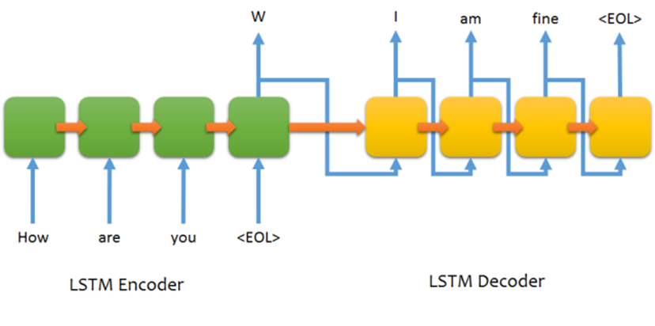

## Novel Writer

 - Purpose : Write a short novel by the seq2seq model

 - Materials : 神雕俠侶 (romance_condor_heroes.txt)

 - Model : Seq2seq model with encoder:decoder = 10:10  

## Procedure

 - Chinese segmentation: by jieba with big-5 dictionary (dict.txt.big)

 - Word2vec: by gensim, length = 1024

 - One-hot encoding: each word is a class

 - Model: seq2seq model with LSTM

 - Epoch: 500

 - Optimizer: RMSprop

## Result
 - Performance:  
 Input : 但聽篤篤篤之聲越來越近歐陽鋒忽地坐起  
 Output :  
     Epoch 1  : 尹克西尹克西了的的的的的的的  
     Epoch 5  : 尹克西了了的的是的了  
     Epoch 10 : 張君寶在他了了是了了  
     Epoch 50 : 身來往他分辯他項一拳一道躍起出來跟  
     Epoch 100: 上前見這位如何一起半空中之中藝越寒急流  
     Epoch 200: 正是把斜寒氣光閃閃匕首一燈向都都  
     Epoch 300: 她把這在到勁力在之後  
     Epoch 400: 將過去給在著勁力越來越右掌之下身子  
     Epoch 497: 郭靖見快于是的上前鐵杖出  
     Epoch 499: 郭靖找到快華山的敵軍刀法刺去但  
     Epoch 500: 便相互快不忍不會膻中侵入紛紛出但  
  
 - Novel Writer Test:  
 Initial Input : 楊過怒道郭靖你還我爹爹命來  
 Output :  
 郭靖道我一生幫焦急麼楊過道我 
爹爹媽媽長大死殺人心想他于是行走大師 
只聽楊過朗探子啊喲說道郭二也明明白白了 
郭襄見的蹤跡相見那料到每人和他兩個 
難道他二人自來聯手自己在嘉興宮學藝說道 
你大我經書我弟弟你她記得在 
何處睡覺好了你的叫做老頑童 
就幾位你是否再這四人我也逃走受 
陸立鼎走上來微微一笑說道我乃她們蓉脫手 
不見見他掌力汗水之聲通紅軍加緊直至 
 
     
